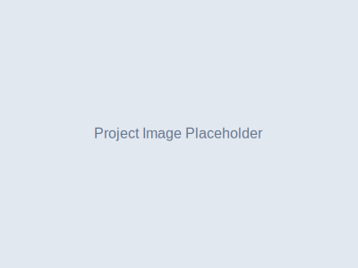

# MTI Project Images Guide

## Current Image Needs

The website currently uses `img/placeholder.svg` for all project images. To enhance the professional appearance, replace these with actual project photos:

### Images to Replace:

1. **SIGMA Facility Electrical Upgrades** (index.html:181, projects.html)
   - Current: `img/placeholder.svg`
   - Needed: Electrical infrastructure, control rooms, or facility exterior

2. **Exascale Supercomputing Infrastructure** (index.html:215)
   - Current: `img/placeholder.svg`  
   - Needed: Data center, server racks, or computing facility

3. **TA-50 Warehouse Transformation** (index.html:230)
   - Current: `img/placeholder.svg`
   - Needed: Industrial warehouse renovation or construction

4. **TA-22 Explosion-Proof Modular** (index.html:245)
   - Current: `img/placeholder.svg`
   - Needed: Specialized industrial construction or modular building

5. **Leadership Team Photos** (team.html:342, 374)
   - Current: `img/placeholder.svg`
   - Needed: Professional headshots of Michael and Vanessa Sanchez

## Free Image Sources for Government/Industrial Construction:

### 1. **Unsplash** (https://unsplash.com)
**Search terms:**
- "electrical infrastructure"
- "data center construction" 
- "industrial construction"
- "server room"
- "electrical panels"
- "construction site government"

### 2. **Pexels** (https://pexels.com)
**Search terms:**
- "electrical work"
- "data center"
- "construction electrical"
- "industrial facility"
- "server infrastructure"

### 3. **Pixabay** (https://pixabay.com)
**Search terms:**
- "electrical installation"
- "data center"
- "industrial construction"
- "electrical engineering"

## Recommended Image Specifications:

- **Format:** JPG or PNG
- **Resolution:** 1200x800px minimum
- **Aspect Ratio:** 3:2 (landscape)
- **File Size:** Under 500KB (optimized for web)
- **Style:** Professional, industrial, government-appropriate

## Professional Photography Options:

### For Actual MTI Project Photos:
1. **Document existing projects** with professional photography
2. **LANL public areas** (if photography permitted)
3. **Generic electrical/construction work** that represents MTI's capabilities
4. **Before/after renovation shots** of completed projects

### For Leadership Photos:
1. **Professional headshots** in business attire
2. **White or neutral backgrounds**
3. **High resolution** (300 DPI minimum)
4. **Consistent lighting and style**

## Implementation:

Once you have the images:

1. **Optimize images** for web (compress to under 500KB)
2. **Name appropriately:**
   - `sigma-facility.jpg`
   - `supercomputing-facility.jpg`
   - `ta50-warehouse.jpg`
   - `ta22-modular.jpg`
   - `michael-sanchez.jpg`
   - `vanessa-sanchez.jpg`

3. **Add to img/ folder**

4. **Update HTML files** to replace `img/placeholder.svg` references

5. **Test on all devices** to ensure proper loading and appearance

## Example HTML Updates:

```html
<!-- Before -->


<!-- After -->

```

This will transform the website from using generic placeholders to showcasing actual professional project imagery that demonstrates MTI's government construction capabilities.